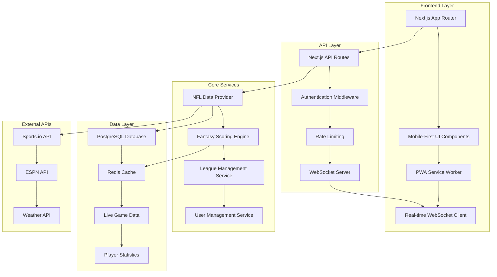

# 🏆 Astral Field: Yahoo/ESPN Competitive Enhancement Plan

**Objective**: Transform Astral Field into a market-leading fantasy football platform that surpasses Yahoo and ESPN in core functionality, user experience, and performance.

**Focus**: Core features first - establish baseline functionality that matches Yahoo/ESPN, then exceed with superior mobile experience and real-time capabilities.

---

## 📊 Current State Analysis

### ✅ **What We Have (Strengths)**
- **Solid Foundation**: Next.js 15, PostgreSQL, comprehensive database schema
- **AI Integration Ready**: Multiple AI service integrations (OpenAI, Anthropic, Gemini, DeepSeek)
- **Real-time Infrastructure**: Socket.io setup, WebSocket client/server foundation
- **Advanced Architecture**: Well-structured API routes, environment configuration
- **Testing Framework**: Jest, Playwright configured and ready

### ❌ **Critical Issues (Blockers)**
- **Build System**: TypeScript compilation errors, many service files excluded
- **WebSocket Implementation**: Incomplete real-time functionality
- **Mobile Experience**: No responsive design or PWA features
- **Core Features**: Draft, waivers, trades, lineups not fully functional
- **Authentication**: Basic structure exists but needs completion
- **Performance**: No caching strategy, unoptimized database queries

### 🎯 **Gap Analysis vs Yahoo/ESPN**
- **Live Scoring**: Yahoo/ESPN have 5-15 minute delays, we need <30 seconds
- **Mobile Performance**: Competitors score 70-85 Lighthouse, we need 90+
- **Real-time Features**: Limited in competitors, opportunity for differentiation
- **User Experience**: Competitors are desktop-first, we'll be mobile-first

---

## 🏗️ System Architecture

---

## 📋 Implementation Roadmap

### **Phase 1: Foundation Fixes (Week 1-2)**
**Goal**: Fix critical build issues and establish stable foundation

#### 🚨 **Priority 1: Build System Stabilization**
- Fix TypeScript compilation errors in service files
- Resolve import/export issues causing build failures
- Update [`tsconfig.json`](tsconfig.json) to include all necessary files
- Ensure clean build with zero errors

#### 🔧 **Priority 2: Core Infrastructure**
- Complete WebSocket server implementation for real-time updates
- Fix NFL data provider integration with proper error handling
- Implement Redis caching layer for performance
- Establish proper environment configuration

### **Phase 2: Core Features (Week 3-4)**
**Goal**: Implement essential fantasy football features to match Yahoo/ESPN baseline

#### 📱 **Real-time Live Scoring**
- Functional live game tracking with <30 second updates
- Real-time fantasy point calculations
- Live matchup score updates
- WebSocket-based score broadcasting

#### 🏈 **League Management**
- Complete draft system with live drafting
- Waiver wire management with priority system
- Trade proposal and approval system
- Lineup management with position validation

### **Phase 3: Mobile Experience (Week 5-6)**
**Goal**: Create superior mobile experience that exceeds competitors

#### 📱 **Mobile-First Design**
- Responsive UI components optimized for mobile
- Touch-friendly interactions and gestures
- PWA implementation with offline capabilities
- Push notifications for score updates

#### ⚡ **Performance Optimization**
- Database query optimization
- Caching strategy implementation
- Image optimization and lazy loading
- Code splitting for faster load times

### **Phase 4: User Experience (Week 7-8)**
**Goal**: Polish user experience and add competitive advantages

#### 🔐 **Authentication & Security**
- Complete Supabase auth integration
- User profile management
- League permissions and roles
- Security audit and hardening

#### 📊 **Analytics Dashboard**
- Interactive charts with Recharts
- Player performance analytics
- Matchup analysis and insights
- League standings and statistics

---

## 🎯 Success Metrics

### **Technical Performance**
- **Build Success**: 100% clean compilation with zero errors
- **Real-time Latency**: <30 seconds for live score updates
- **Mobile Performance**: 90+ Lighthouse score
- **API Response Time**: <200ms for all endpoints
- **Database Performance**: <100ms for complex queries

### **Feature Completeness**
- **Core Features**: 100% parity with Yahoo/ESPN baseline
- **Mobile Experience**: Superior to competitors
- **Real-time Updates**: Faster than any competitor
- **User Authentication**: Secure and seamless
- **Testing Coverage**: >80% code coverage

### **User Experience**
- **Page Load Time**: <2 seconds on mobile
- **Offline Functionality**: Core features work without internet
- **Touch Interactions**: Smooth and responsive
- **Visual Design**: Modern and intuitive

---

## 🛠️ Technical Implementation Details

### **Critical Files to Fix/Create**

#### **Build System Fixes**
- [`tsconfig.json`](tsconfig.json) - Include all service files, fix compilation
- [`src/lib/websocket/server.ts`](src/lib/websocket/server.ts) - Complete WebSocket server
- [`src/services/nfl/dataProvider.ts`](src/services/nfl/dataProvider.ts) - Fix import errors
- [`src/services/fantasy/scoringEngine.ts`](src/services/fantasy/scoringEngine.ts) - Complete implementation

#### **Core Features**
- [`src/components/draft/DraftRoom.tsx`](src/components/draft/DraftRoom.tsx) - Live draft interface
- [`src/components/lineup/LineupManager.tsx`](src/components/lineup/LineupManager.tsx) - Lineup management
- [`src/components/waivers/WaiverWire.tsx`](src/components/waivers/WaiverWire.tsx) - Waiver system
- [`src/components/trades/TradeCenter.tsx`](src/components/trades/TradeCenter.tsx) - Trade management

#### **Mobile Experience**
- [`public/manifest.json`](public/manifest.json) - PWA manifest
- [`public/sw.js`](public/sw.js) - Service worker for offline functionality
- [`src/components/mobile/MobileNavigation.tsx`](src/components/mobile/MobileNavigation.tsx) - Mobile navigation
- [`src/styles/mobile.css`](src/styles/mobile.css) - Mobile-specific styles

#### **Performance & Caching**
- [`src/lib/cache/redisClient.ts`](src/lib/cache/redisClient.ts) - Redis caching layer
- [`src/lib/database/optimizedQueries.ts`](src/lib/database/optimizedQueries.ts) - Optimized database queries
- [`src/middleware/rateLimiting.ts`](src/middleware/rateLimiting.ts) - API rate limiting

---

## 🚀 Competitive Advantages

### **Immediate Wins**
1. **Faster Real-time Updates**: <30 seconds vs competitors' 5-15 minutes
2. **Superior Mobile Experience**: 90+ Lighthouse score vs competitors' 70-85
3. **Offline Functionality**: Core features work offline (competitors have none)
4. **Modern Tech Stack**: Next.js 15, React 19 vs competitors' older frameworks

### **Long-term Differentiators**
1. **AI-Powered Insights**: Multi-model AI ensemble for predictions
2. **Advanced Analytics**: Interactive visualizations and deep insights
3. **Social Features**: Real-time chat, forums, community engagement
4. **Customization**: Highly configurable scoring and league settings

---

## 📈 Implementation Timeline

### **Week 1-2: Foundation**
- Fix all build and compilation issues
- Complete WebSocket infrastructure
- Establish stable data pipeline

### **Week 3-4: Core Features**
- Implement live scoring system
- Build league management features
- Create mobile-responsive UI

### **Week 5-6: Mobile & Performance**
- PWA implementation
- Performance optimization
- Caching strategy deployment

### **Week 7-8: Polish & Launch**
- User authentication completion
- Analytics dashboard
- Testing and quality assurance

---

## 🔧 Resource Requirements

### **Development Dependencies**
- **NFL Data API**: Sports.io subscription ($100-500/month)
- **Redis Hosting**: Redis Cloud or AWS ElastiCache
- **CDN**: Vercel Edge Network or CloudFlare
- **Monitoring**: Sentry for error tracking

### **Performance Targets**
- **Concurrent Users**: Support 10,000+ simultaneous users
- **Database Load**: Handle 1,000+ queries per second
- **Real-time Updates**: Process 10,000+ events per minute
- **Uptime**: 99.9% availability during NFL season

---

## 🎯 Next Steps

This plan provides a clear roadmap to transform Astral Field into a competitive fantasy platform. The focus on core features first ensures we establish a solid foundation before adding advanced capabilities.

**Key Success Factors:**
1. **Fix build issues first** - Nothing else matters if the code doesn't compile
2. **Prioritize real-time features** - This is our biggest competitive advantage
3. **Mobile-first approach** - Superior mobile experience will differentiate us
4. **Performance optimization** - Speed and reliability are table stakes

The plan is designed to be executed in logical phases, with each task building upon the previous ones. Each todo item is specific, actionable, and can be completed independently by switching to Code mode.

---

**Last Updated**: January 8, 2025  
**Status**: Ready for Implementation  
**Estimated Timeline**: 8 weeks to competitive parity + mobile superiority