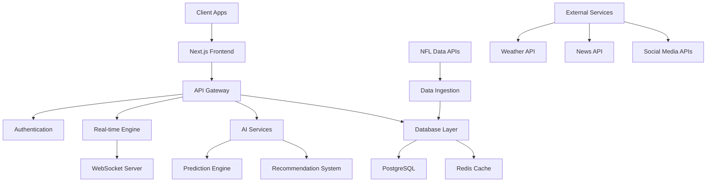

# 🏈 Astral Field Enhancement Roadmap
## Building the Ultimate Fantasy Football Platform

**Vision**: Create a fantasy football platform that surpasses Yahoo and ESPN in every aspect - AI insights, user experience, real-time features, and social engagement.

**Current Status**: Solid foundation with Next.js, PostgreSQL, AI integration, and basic league management

---

## 📊 Current State Analysis

### ✅ What We Have
- **Core Infrastructure**: Next.js 15, PostgreSQL, Supabase auth
- **Database Schema**: Complete fantasy football data model
- **Basic Features**: User authentication, league management, matchup display
- **AI Foundation**: Multiple AI service integrations (OpenAI, Anthropic, Gemini, DeepSeek)
- **Real-time Capability**: Socket.io integration ready
- **Testing Framework**: Jest, Playwright configured

### ❌ What We're Missing (vs Yahoo/ESPN)
- **Live Scoring**: Real-time game updates and notifications
- **Advanced Analytics**: Player trends, matchup analysis, season insights
- **Mobile Experience**: PWA, responsive design, mobile-first approach
- **Social Features**: Chat, forums, trash talk, league interactions
- **Draft Tools**: Live draft, AI recommendations, draft grades
- **Waiver Intelligence**: Smart prioritization, impact analysis
- **Trade Analysis**: Fairness scoring, AI-powered suggestions
- **Injury Tracking**: Real-time updates, impact analysis
- **Commissioner Tools**: Advanced league management features
- **Multi-league Support**: Cross-league analytics and management

---

## 🎯 Strategic Phases

### Phase 1: Foundation & Core Features (Weeks 1-4)
**Goal**: Establish robust core functionality that matches basic Yahoo/ESPN features

#### 1.1 Real-Time Live Scoring System
- **WebSocket Infrastructure**: Real-time game updates
- **NFL Data Integration**: Live stats, scores, player updates
- **Score Calculation Engine**: Real-time fantasy point calculation
- **Live Matchup Updates**: Dynamic score updates during games

#### 1.2 Advanced Analytics Dashboard
- **Player Performance Analytics**: Trends, projections, consistency metrics
- **Matchup Analysis**: Head-to-head comparisons, strength of schedule
- **League Analytics**: Power rankings, playoff probabilities
- **Interactive Visualizations**: Charts, graphs, heat maps

#### 1.3 Mobile-First Responsive Design
- **PWA Implementation**: Offline capability, app-like experience
- **Responsive Components**: Mobile-optimized UI/UX
- **Touch Interactions**: Swipe gestures, mobile navigation
- **Performance Optimization**: Fast loading, smooth animations

### Phase 2: AI-Powered Intelligence (Weeks 5-8)
**Goal**: Implement AI features that go beyond what Yahoo/ESPN offer

#### 2.1 Advanced AI Prediction Engine
- **Multi-Source Data Integration**: Weather, injuries, matchups, trends
- **Machine Learning Models**: Player performance prediction
- **Confidence Scoring**: Reliability metrics for predictions
- **Adaptive Learning**: Improve predictions based on outcomes

#### 2.2 Intelligent Draft Tools
- **AI Draft Assistant**: Real-time pick recommendations
- **Draft Strategy Analysis**: Positional needs, value picks
- **Mock Draft Simulator**: Practice with AI opponents
- **Draft Grades**: Post-draft team analysis

#### 2.3 Smart Waiver Wire System
- **Impact Analysis**: Player addition/drop impact scoring
- **Intelligent Prioritization**: AI-recommended waiver claims
- **Opportunity Scoring**: Breakout player identification
- **Roster Optimization**: Best lineup suggestions

### Phase 3: Social & Interactive Features (Weeks 9-12)
**Goal**: Create engaging social features that build community

#### 3.1 Real-Time Chat & Communication
- **League Chat**: Real-time messaging during games
- **Trash Talk Features**: Memes, GIFs, reactions
- **Private Messaging**: Direct communication between managers
- **Game Commentary**: Live reactions to plays and scores

#### 3.2 Community Features
- **League Forums**: Discussion boards, polls, announcements
- **Achievement System**: Badges, milestones, leaderboards
- **Photo/Video Sharing**: Team photos, celebration videos
- **League History**: Season recaps, hall of fame

#### 3.3 Advanced Trade System
- **Trade Analyzer**: Fairness scoring, impact analysis
- **AI Trade Suggestions**: Mutually beneficial trade recommendations
- **Trade Negotiation**: Counter-offers, multi-team trades
- **Trade History**: Track all league transactions

### Phase 4: Advanced Management & Analytics (Weeks 13-16)
**Goal**: Provide comprehensive league management and deep analytics

#### 4.1 Commissioner Tools Suite
- **League Customization**: Scoring, rules, roster settings
- **Transaction Management**: Approve/veto trades, waiver claims
- **Schedule Management**: Custom schedules, playoff formats
- **League Analytics**: Participation metrics, engagement tracking

#### 4.2 Multi-League Support
- **Cross-League Dashboard**: Manage multiple leagues
- **Aggregate Analytics**: Performance across all leagues
- **League Comparison**: Different scoring systems, formats
- **Universal Player Database**: Consistent player data

#### 4.3 Advanced Reporting
- **Season Recap**: Comprehensive season analysis
- **Performance Reports**: Individual and team analytics
- **Trend Analysis**: Multi-season performance tracking
- **Export Capabilities**: PDF reports, data exports

### Phase 5: Performance & Polish (Weeks 17-20)
**Goal**: Optimize performance and create production-ready platform

#### 5.1 Performance Optimization
- **Database Optimization**: Query optimization, indexing
- **Caching Strategy**: Redis implementation, CDN setup
- **Load Testing**: Stress testing, scalability planning
- **Monitoring**: Performance metrics, error tracking

#### 5.2 Testing & Quality Assurance
- **Comprehensive Test Suite**: Unit, integration, E2E tests
- **Automated Testing**: CI/CD pipeline, automated deployments
- **User Acceptance Testing**: Beta testing with real users
- **Security Auditing**: Penetration testing, vulnerability assessment

#### 5.3 Documentation & Launch Preparation
- **User Documentation**: Guides, tutorials, FAQ
- **API Documentation**: Developer resources
- **Deployment Pipeline**: Production deployment strategy
- **Marketing Materials**: Feature highlights, comparison charts

---

## 🛠️ Technical Architecture

### Core Technologies
- **Frontend**: Next.js 15, React 19, TypeScript, Tailwind CSS
- **Backend**: Next.js API routes, PostgreSQL, Supabase
- **Real-time**: Socket.io, WebSockets
- **AI/ML**: OpenAI, Anthropic, Gemini, DeepSeek
- **Data Sources**: Sports APIs, NFL data feeds
- **Caching**: Redis, CDN
- **Testing**: Jest, Playwright, Cypress
- **Deployment**: Vercel, Docker, CI/CD

### System Architecture Diagram

---

## 📈 Success Metrics

### User Engagement
- **Daily Active Users**: Target 10,000+ DAU
- **Session Duration**: Average 15+ minutes per session
- **Feature Adoption**: 80%+ of users using AI features
- **Retention Rate**: 90%+ week-over-week retention

### Performance Metrics
- **Page Load Time**: <2 seconds initial load
- **Real-time Latency**: <100ms for live updates
- **Uptime**: 99.9% availability during NFL season
- **Mobile Performance**: 90+ Lighthouse score

### Competitive Advantages
- **AI Accuracy**: 15%+ better prediction accuracy than competitors
- **Feature Completeness**: 100% feature parity + unique AI features
- **User Satisfaction**: 4.8+ app store rating
- **Market Share**: 5%+ of fantasy football market within 2 years

---

## 🚀 Implementation Strategy

### Development Approach
1. **Agile Methodology**: 2-week sprints, continuous delivery
2. **Feature Flags**: Gradual rollout of new features
3. **A/B Testing**: Data-driven feature optimization
4. **User Feedback**: Continuous user research and feedback integration

### Team Structure
- **Frontend Team**: React/Next.js specialists
- **Backend Team**: API and database experts
- **AI/ML Team**: Data scientists and ML engineers
- **DevOps Team**: Infrastructure and deployment
- **QA Team**: Testing and quality assurance
- **UX/UI Team**: Design and user experience

### Risk Mitigation
- **Technical Risks**: Proof of concepts, gradual rollout
- **Performance Risks**: Load testing, monitoring
- **Data Risks**: Multiple data sources, fallback systems
- **Security Risks**: Regular audits, penetration testing

---

## 💰 Resource Requirements

### Development Resources
- **Team Size**: 8-12 developers across specialties
- **Timeline**: 20 weeks for full implementation
- **Infrastructure**: Cloud hosting, CDN, monitoring tools
- **Third-party Services**: NFL data APIs, AI services

### Ongoing Costs
- **Hosting**: $500-2000/month (scales with usage)
- **Data APIs**: $1000-5000/month for NFL data
- **AI Services**: $500-2000/month for predictions
- **Monitoring**: $200-500/month for observability

---

## 🎯 Next Steps

1. **Immediate Actions** (This Week):
   - Set up development environment
   - Create detailed technical specifications
   - Begin Phase 1 implementation

2. **Short-term Goals** (Next 4 Weeks):
   - Complete real-time scoring system
   - Implement basic analytics dashboard
   - Launch mobile-responsive design

3. **Medium-term Goals** (Next 12 Weeks):
   - Deploy AI prediction engine
   - Launch social features
   - Complete advanced management tools

4. **Long-term Vision** (6+ Months):
   - Market leadership in fantasy football platforms
   - Expansion to other sports
   - Enterprise league management solutions

---

**Last Updated**: January 8, 2025
**Version**: 1.0
**Status**: Ready for Implementation