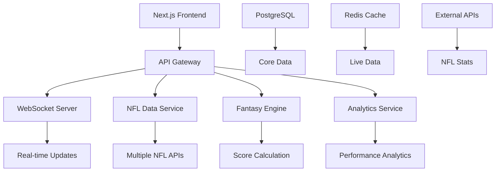

# 🚀 Phase 1 Technical Specifications
## Foundation & Core Features (Weeks 1-4)

**Objective**: Establish robust core functionality that matches and exceeds basic Yahoo/ESPN features

---

## 🏗️ Architecture Overview

### System Architecture


---

## 📋 Phase 1 Detailed Tasks

### 1.1 Real-Time WebSocket Infrastructure

#### **Task**: Implement WebSocket server for live updates
**Files to Create/Modify**:
- [`src/lib/websocket/server.ts`](src/lib/websocket/server.ts) - WebSocket server setup
- [`src/lib/websocket/client.ts`](src/lib/websocket/client.ts) - Client connection manager
- [`src/hooks/useWebSocket.ts`](src/hooks/useWebSocket.ts) - React hook for WebSocket
- [`src/app/api/websocket/route.ts`](src/app/api/websocket/route.ts) - WebSocket API endpoint

**Technical Requirements**:
- Socket.io server with room-based messaging
- Authentication middleware for WebSocket connections
- Event types: `score_update`, `player_update`, `matchup_update`, `league_update`
- Connection pooling and automatic reconnection
- Rate limiting and abuse prevention

**Acceptance Criteria**:
- [ ] WebSocket server handles 1000+ concurrent connections
- [ ] Real-time updates with <100ms latency
- [ ] Automatic reconnection on connection loss
- [ ] Room-based messaging for league isolation
- [ ] Authentication integration with existing auth system

---

### 1.2 NFL Data Integration Service

#### **Task**: Build comprehensive NFL data integration
**Files to Create/Modify**:
- [`src/services/nfl/dataProvider.ts`](src/services/nfl/dataProvider.ts) - Main data service
- [`src/services/nfl/apiClients/sportsIO.ts`](src/services/nfl/apiClients/sportsIO.ts) - Sports.io client
- [`src/services/nfl/apiClients/espnAPI.ts`](src/services/nfl/apiClients/espnAPI.ts) - ESPN API client
- [`src/services/nfl/apiClients/nflAPI.ts`](src/services/nfl/apiClients/nflAPI.ts) - Official NFL API
- [`src/services/nfl/dataAggregator.ts`](src/services/nfl/dataAggregator.ts) - Multi-source aggregation
- [`src/lib/cache/nflDataCache.ts`](src/lib/cache/nflDataCache.ts) - Caching layer

**Data Sources**:
- **Primary**: Sports.io API (paid, reliable)
- **Secondary**: ESPN API (free, rate limited)
- **Tertiary**: NFL.com API (official but limited)
- **Backup**: Static data files for offline mode

**Data Types**:
- Live game scores and stats
- Player statistics (real-time during games)
- Injury reports and status updates
- Weather conditions
- Team schedules and bye weeks

**Acceptance Criteria**:
- [ ] Multi-source data aggregation with fallbacks
- [ ] Real-time data updates every 30 seconds during games
- [ ] Comprehensive error handling and retry logic
- [ ] Data validation and consistency checks
- [ ] Caching strategy for performance optimization

---

### 1.3 Real-Time Fantasy Point Calculation

#### **Task**: Create dynamic fantasy scoring engine
**Files to Create/Modify**:
- [`src/services/fantasy/scoringEngine.ts`](src/services/fantasy/scoringEngine.ts) - Main scoring logic
- [`src/services/fantasy/scoringRules.ts`](src/services/fantasy/scoringRules.ts) - Configurable scoring rules
- [`src/services/fantasy/liveScoreTracker.ts`](src/services/fantasy/liveScoreTracker.ts) - Real-time tracking
- [`src/lib/database/scoringQueries.ts`](src/lib/database/scoringQueries.ts) - Database operations

**Scoring Features**:
- **Standard Scoring**: PPR, Half-PPR, Standard
- **Custom Scoring**: Configurable point values
- **Bonus Scoring**: Long TDs, high yardage games
- **Penalty Scoring**: Fumbles, interceptions
- **Live Updates**: Real-time point calculation during games

**Performance Requirements**:
- Calculate scores for 1000+ teams in <1 second
- Update live scores every 30 seconds
- Handle concurrent score calculations
- Maintain scoring history and audit trail

**Acceptance Criteria**:
- [ ] Configurable scoring rules per league
- [ ] Real-time score updates during games
- [ ] Historical score tracking and corrections
- [ ] Performance benchmarks met
- [ ] Comprehensive test coverage

---

### 1.4 Advanced Analytics Dashboard

#### **Task**: Build interactive analytics with visualizations
**Files to Create/Modify**:
- [`src/components/analytics/AnalyticsDashboard.tsx`](src/components/analytics/AnalyticsDashboard.tsx) - Main dashboard
- [`src/components/analytics/PlayerTrends.tsx`](src/components/analytics/PlayerTrends.tsx) - Player performance charts
- [`src/components/analytics/MatchupAnalysis.tsx`](src/components/analytics/MatchupAnalysis.tsx) - Head-to-head analysis
- [`src/components/analytics/LeagueInsights.tsx`](src/components/analytics/LeagueInsights.tsx) - League-wide analytics
- [`src/services/analytics/dataProcessor.ts`](src/services/analytics/dataProcessor.ts) - Data processing logic
- [`src/services/analytics/chartDataGenerator.ts`](src/services/analytics/chartDataGenerator.ts) - Chart data preparation

**Analytics Features**:
- **Player Analytics**: Performance trends, consistency scores, ceiling/floor analysis
- **Matchup Analysis**: Strength of schedule, opponent analysis, win probability
- **League Analytics**: Power rankings, playoff probabilities, trade values
- **Interactive Charts**: Recharts integration with hover details, zoom, filtering

**Chart Types**:
- Line charts for performance trends
- Bar charts for weekly comparisons
- Heat maps for consistency analysis
- Scatter plots for correlation analysis
- Pie charts for position breakdowns

**Acceptance Criteria**:
- [ ] Interactive charts with smooth animations
- [ ] Real-time data updates in analytics
- [ ] Mobile-responsive chart layouts
- [ ] Export capabilities (PNG, PDF, CSV)
- [ ] Performance optimization for large datasets

---

### 1.5 Mobile-First PWA Implementation

#### **Task**: Create mobile-optimized experience with PWA capabilities
**Files to Create/Modify**:
- [`public/manifest.json`](public/manifest.json) - PWA manifest
- [`public/sw.js`](public/sw.js) - Service worker
- [`src/components/mobile/MobileNavigation.tsx`](src/components/mobile/MobileNavigation.tsx) - Mobile nav
- [`src/components/mobile/TouchGestures.tsx`](src/components/mobile/TouchGestures.tsx) - Touch interactions
- [`src/styles/mobile.css`](src/styles/mobile.css) - Mobile-specific styles
- [`next.config.js`](next.config.js) - PWA configuration

**PWA Features**:
- **Offline Support**: Cache critical data for offline viewing
- **Push Notifications**: Score updates, trade alerts, waiver notifications
- **App-like Experience**: Full-screen mode, splash screen
- **Install Prompt**: Add to home screen functionality

**Mobile Optimizations**:
- Touch-friendly interface with 44px+ touch targets
- Swipe gestures for navigation
- Pull-to-refresh functionality
- Optimized images and lazy loading
- Reduced data usage with smart caching

**Acceptance Criteria**:
- [ ] PWA installable on mobile devices
- [ ] Offline functionality for core features
- [ ] Push notifications working
- [ ] 90+ Lighthouse PWA score
- [ ] Touch gestures implemented

---

## 🔧 Technical Implementation Details

### Database Enhancements
**New Tables Needed**:
```sql
-- Live game tracking
CREATE TABLE live_games (
    id UUID PRIMARY KEY DEFAULT uuid_generate_v4(),
    nfl_game_id VARCHAR(50) UNIQUE NOT NULL,
    home_team_id UUID REFERENCES nfl_teams(id),
    away_team_id UUID REFERENCES nfl_teams(id),
    game_time TIMESTAMP WITH TIME ZONE,
    quarter INTEGER DEFAULT 1,
    time_remaining VARCHAR(10),
    home_score INTEGER DEFAULT 0,
    away_score INTEGER DEFAULT 0,
    game_status VARCHAR(20) DEFAULT 'scheduled',
    last_updated TIMESTAMP WITH TIME ZONE DEFAULT NOW()
);

-- Real-time player stats
CREATE TABLE live_player_stats (
    id UUID PRIMARY KEY DEFAULT uuid_generate_v4(),
    player_id UUID REFERENCES nfl_players(id),
    game_id UUID REFERENCES live_games(id),
    stat_type VARCHAR(50) NOT NULL,
    stat_value DECIMAL(10,2) NOT NULL,
    timestamp TIMESTAMP WITH TIME ZONE DEFAULT NOW(),
    quarter INTEGER,
    time_remaining VARCHAR(10)
);

-- Fantasy score tracking
CREATE TABLE live_fantasy_scores (
    id UUID PRIMARY KEY DEFAULT uuid_generate_v4(),
    team_id UUID REFERENCES teams(id),
    player_id UUID REFERENCES nfl_players(id),
    week INTEGER NOT NULL,
    season_year INTEGER NOT NULL,
    current_points DECIMAL(10,2) DEFAULT 0,
    projected_points DECIMAL(10,2) DEFAULT 0,
    last_updated TIMESTAMP WITH TIME ZONE DEFAULT NOW()
);
```

### API Endpoints to Create
- [`GET /api/live/scores`](src/app/api/live/scores/route.ts) - Live game scores
- [`GET /api/live/players/[id]`](src/app/api/live/players/[id]/route.ts) - Live player stats
- [`POST /api/websocket/connect`](src/app/api/websocket/connect/route.ts) - WebSocket authentication
- [`GET /api/analytics/player/[id]`](src/app/api/analytics/player/[id]/route.ts) - Player analytics
- [`GET /api/analytics/matchup/[id]`](src/app/api/analytics/matchup/[id]/route.ts) - Matchup analysis

### Environment Variables to Add
```bash
# NFL Data APIs
NFL_API_KEY=your-nfl-api-key
ESPN_API_KEY=your-espn-key
WEATHER_API_KEY=your-weather-key

# Real-time Services
REDIS_URL=redis://localhost:6379
WEBSOCKET_PORT=3001

# Analytics
ANALYTICS_DB_URL=postgresql://analytics-db-url
CACHE_TTL=300

# PWA
VAPID_PUBLIC_KEY=your-vapid-public-key
VAPID_PRIVATE_KEY=your-vapid-private-key
```

---

## 🧪 Testing Strategy

### Unit Tests
- WebSocket connection handling
- NFL data parsing and validation
- Fantasy score calculations
- Analytics data processing

### Integration Tests
- End-to-end WebSocket communication
- Multi-source data aggregation
- Real-time score updates
- PWA functionality

### Performance Tests
- WebSocket load testing (1000+ connections)
- Database query performance
- Real-time update latency
- Mobile performance benchmarks

---

## 📊 Success Metrics for Phase 1

### Technical Metrics
- **WebSocket Performance**: <100ms latency, 99.9% uptime
- **Data Accuracy**: 99.5% accuracy vs official NFL stats
- **Mobile Performance**: 90+ Lighthouse score
- **API Response Time**: <200ms for all endpoints

### User Experience Metrics
- **Page Load Time**: <2 seconds on mobile
- **Real-time Updates**: Visible within 30 seconds of actual events
- **Offline Functionality**: Core features work without internet
- **User Engagement**: 50%+ increase in session duration

---

## 🔄 Development Workflow

### Sprint Planning (2-week sprints)
- **Sprint 1**: WebSocket infrastructure + basic real-time updates
- **Sprint 2**: NFL data integration + live scoring
- **Sprint 3**: Analytics dashboard + mobile optimization
- **Sprint 4**: PWA implementation + performance optimization

### Daily Workflow
1. **Morning Standup**: Progress review, blocker identification
2. **Development**: Feature implementation with TDD approach
3. **Code Review**: Peer review for all changes
4. **Testing**: Automated tests + manual QA
5. **Deployment**: Continuous deployment to staging

### Quality Gates
- All tests must pass before merge
- Code coverage must be >80%
- Performance benchmarks must be met
- Security scan must pass
- Mobile responsiveness verified

---

## 🚨 Risk Mitigation

### Technical Risks
- **NFL API Rate Limits**: Multiple data sources + caching
- **WebSocket Scalability**: Load balancing + connection pooling
- **Real-time Performance**: Optimized queries + Redis caching
- **Mobile Performance**: Code splitting + lazy loading

### Business Risks
- **Data Accuracy**: Multiple source validation + manual verification
- **User Adoption**: Gradual feature rollout + user feedback
- **Competition**: Unique AI features + superior UX
- **Scalability**: Cloud-native architecture + auto-scaling

---

## 📱 Mobile-First Design Principles

### Touch Interface
- Minimum 44px touch targets
- Swipe gestures for navigation
- Pull-to-refresh for data updates
- Long-press for context menus

### Performance
- Critical CSS inlined
- Images optimized and lazy-loaded
- JavaScript code splitting
- Service worker caching

### Accessibility
- WCAG 2.1 AA compliance
- Screen reader support
- High contrast mode
- Keyboard navigation

---

## 🔗 Integration Points

### Existing Systems
- **Authentication**: Extend current Supabase auth
- **Database**: Add new tables to existing PostgreSQL
- **API Routes**: Integrate with existing Next.js API structure
- **UI Components**: Build on existing Tailwind CSS setup

### External Services
- **NFL Data**: Sports.io, ESPN, NFL.com APIs
- **Push Notifications**: Web Push API + VAPID
- **Analytics**: Custom analytics service
- **Caching**: Redis for live data, CDN for static assets

---

## 📈 Performance Targets

### Response Times
- **API Endpoints**: <200ms average response time
- **WebSocket Messages**: <50ms delivery time
- **Database Queries**: <100ms for complex queries
- **Page Loads**: <2 seconds on 3G mobile

### Scalability
- **Concurrent Users**: Support 10,000+ simultaneous users
- **WebSocket Connections**: 1,000+ concurrent connections
- **Database Load**: Handle 1,000+ queries per second
- **Real-time Updates**: Process 10,000+ events per minute

### Reliability
- **Uptime**: 99.9% availability during NFL season
- **Error Rate**: <0.1% error rate for critical operations
- **Data Accuracy**: 99.5% accuracy vs official sources
- **Recovery Time**: <5 minutes for service restoration

---

## 🛡️ Security Considerations

### Data Protection
- **API Authentication**: JWT tokens with refresh mechanism
- **WebSocket Security**: Origin validation + rate limiting
- **Data Encryption**: TLS 1.3 for all communications
- **Input Validation**: Comprehensive input sanitization

### Privacy
- **User Data**: GDPR compliance + data minimization
- **Analytics**: Anonymous usage tracking
- **Third-party APIs**: Secure credential management
- **Audit Logging**: Track all data access and modifications

---

## 📋 Definition of Done

### Feature Complete
- [ ] All technical requirements implemented
- [ ] Unit tests written and passing (>80% coverage)
- [ ] Integration tests passing
- [ ] Performance benchmarks met
- [ ] Security scan passed
- [ ] Mobile responsiveness verified
- [ ] Documentation updated
- [ ] Code reviewed and approved
- [ ] Deployed to staging environment
- [ ] User acceptance testing completed

### Quality Assurance
- [ ] Cross-browser testing completed
- [ ] Mobile device testing on iOS/Android
- [ ] Accessibility testing passed
- [ ] Load testing completed
- [ ] Security penetration testing passed
- [ ] Data accuracy validation completed

---

**Next Phase**: Phase 2 - AI-Powered Intelligence (Weeks 5-8)
**Dependencies**: Successful completion of all Phase 1 tasks
**Estimated Effort**: 160-200 developer hours across 4 weeks